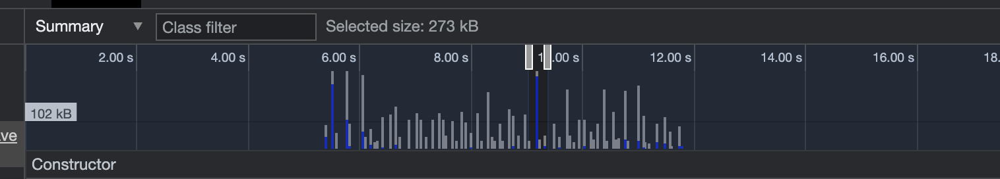

# koa-multipart-stream-to-s3


*Memory allocations timeline during 140Mb file upload.*

## How to run

### Run MinIO (S3 Storage)

`docker-compose -f docker-compose.local.yml up`

### Create Bucket

`koa-multipart-stream-to-s3`

### Start app

`node index.js`

### Make a request

```
curl -X "POST" "http://localhost:3000/upload" \
     -H 'Content-Type: multipart/form-data; charset=utf-8; boundary=__X_PAW_BOUNDARY__' \
     -F "file=" \
     -F "info={\"name\":\"big-file.mov\",\"fileType\":\"movie\"}"
```
